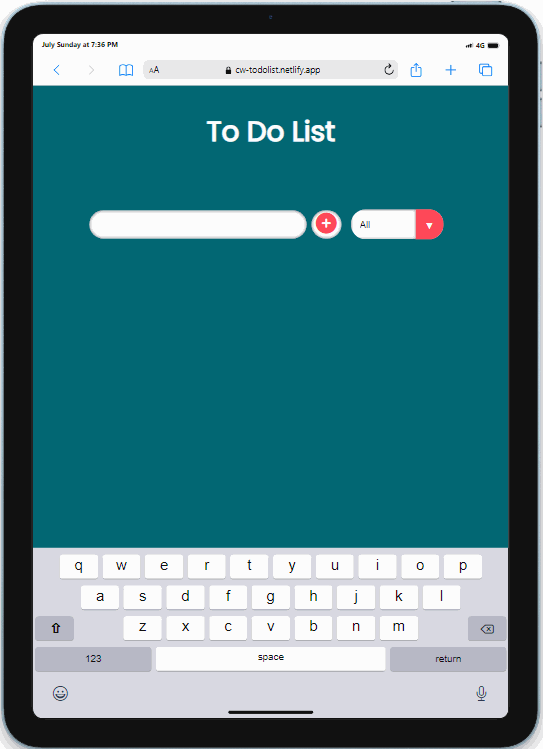

# Project : To-do List App

## Description

Project aims to create a simple To-Do App.

## Project Skeleton

```
To-do List App (folder)
|
|----readme.md         # Given to the students (Definition of the project)
|----solution
        |----index.html
        |----style.css
        |----App.js
```

## Outcome

🔗 [To-do List App](https://cw-todolist.netlify.app)

<br>



### The following issues are covered in the project;

- HTML

- JS

## Resources

- [Images](./img/)
